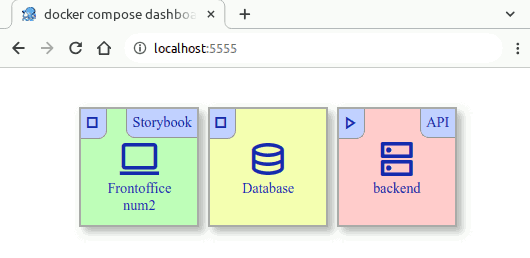

# docker compose dashboard ("docoda" alias?)



## install
```
deno install -f \
    --name dacoda \
    --allow-net=localhost:5555 \
    --allow-env \
    --allow-read \
    --allow-run=/usr/bin/docker \
        https://deno.land/x/docker_compose_dashboard@0.1.0/docker-compose-dashboard.ts
# → run "dacoda" from a docker compose project
```


## or run directly from a docker compose project
```
deno run \
    --name dacoda \
    --allow-net=localhost:5555 \
    --allow-env \
    --allow-read \
    --allow-run=/usr/bin/docker \
        https://deno.land/x/docker_compose_dashboard@0.1.0/docker-compose-dashboard.ts
```


## TODO :

see [docker-compose.yml](example%2Fdocker-compose.yml)

- README.md
  - lib list
    - https://github.com/denoland/deno
    - https://github.com/developit/htm
    - https://github.com/preactjs/preact
    - https://github.com/denoland/deno
- labels
  - dashboard.index:
    - dashboard.title:
    - dashboard.material-symbols-outlined:
    - dashboard.link:
    - dashboard.extra-link:
    - dashboard.extra-text:
